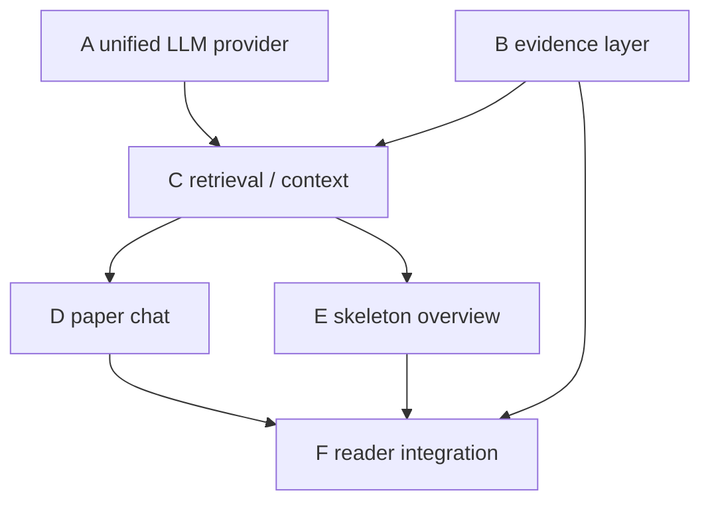

# 0045 Paper Intelligence V1：可验证的单篇论文阅读

日期：2026-09-28。状态：设计提案，尚未实现。代码审计基线：`382bcd2`。
本文件定义跨 Change 的公共契约；各 Change 的 spec 定义可执行验收要求。任何后续实现不得把本文当作已实现能力。

## 1. 目标与验收边界

针对当前已发布论文的一份明确 parse，提供带可点击证据的多轮 Paper Chat，以及按论证结构组织的 Paper Skeleton Overview。Parse 是来源事实层（仍可能含 OCR 错误），Evidence 是可核验引用层，LLM 负责理解与表达；生成内容始终属于派生分析。

V1 验收门槛：
- 非当前 parse、非本轮上下文、伪造及失效 Evidence ID 全部拒绝；页码、figure 标签、链接只由后端产生。
- 中英文跨语言问题能检索到英文术语；有歧义时询问或说明证据不足，不借外部知识补全。
- 长文上下文保留存在的 Conclusion 与尾部 Figure；预算不够时明确覆盖缺口。
- 对话用户隔离、发布权限、parse 版本隔离、并发幂等、错误不污染成功答案均有测试。
- 旧 parse v1/v2、Overview v1/v2、PDF Range 流及原有解析任务继续可用。
- 六个 Change 均 strict validate；本轮只交付文档，实施验收另见 preparation。

不做全库 RAG、多论文问答、联网 research、外部 Related Work、知识图谱、独立向量库、跨论文 memory、复杂 Agent 编排。V1 不新增 MCP 对话工具，也不把新分析自动加入 MCP 正式检索。

## 2. 代码审计与差距

以下路径和行号指向审计基线；实施后行号可能变化，符号名为稳定定位入口。

| 实际模块 | 已有能力与观察 | V1 决策 |
| --- | --- | --- |
| `apps/literature_processing/models.py:80` DocumentParse | job 一对一，normalized/raw artifact SHA、schema、runtime_info；parse 随 job 保留，删除关系为 CASCADE | 直接复用不可变 parse，不改写旧 artifact |
| `models.py:119` LiteratureChunk | chunk_key、起止页、section_path、source_spans、内容哈希 | 复用索引；不把 chunk 当成全部 structured parse |
| `parsers/contracts.py` ParsedBlock | v2 有 figure/caption/table/equation、bbox、source；v1 只有页文本 | Evidence 适配 v1/v2，不强制重新 OCR |
| `parsers/mineru/adapter.py:109,203` | Figure text 为空，asset_path 在 structured_content；caption 单独 block；同 source_index 在不同页可重复 | 按 page + segment + source identity 关联，不能只按 source_index |
| `parsers/mineru/archive.py:22,53` | 外层 bundle 包含 manifest 与 segment ZIP；content list 可能在子目录；没有公共图片读取接口 | 新增受控 asset resolver，不能把 asset_path 当 URL |
| `structure_chunking.py:13,49` | 跳过无文本 Figure；跨页拼接且精确保存 block/chunk offsets | Figure 独立编目；跨页引用按 span 得到真实页 |
| `chunking.py` / `parsers/pypdf_adapter.py` | v1 页内字符窗口与原始页号 | 无结构时仅提供 text evidence，缺失 figure 明示 |
| `persistence.py:14` | 先写派生产物，再短事务保存 parse/chunks；同 job 幂等 | 不把网络/LLM 调用加入写事务，不改变原始存储 |
| `overview.py:13,49` | 前 80,000 字符顺序截断；指纹仅 packet；直接 create analysis | 新 Skeleton 使用结构覆盖、完整生成配置指纹；旧逻辑保留 |
| `overview_provider.py:21` | DeepSeek 专属配置、thinking 参数、两次请求尝试、HTTPS 校验 | 提取中立 transport；DeepSeek 参数仅在兼容适配中出现 |
| `overview_validation.py:10,65` | 校验 chunk 属于 parse、chunk 起始页及双语一致；summary 无逐句 evidence；未约束引用必须来自实际 packet | 旧 validator 保持；新 validator 强制 claim → 本轮 Evidence ID |
| `models.py:185` DocumentAnalysis | 仅 overview 类型；唯一键 parse/type/prompt/fingerprint；save 调用 full_clean | 增加 paper_skeleton 类型与 schema 分派，保留唯一键 |
| `pipeline.py` / `jobs.py:17,190` | parse/chunk 完成后 Overview 失败会使整个 job failed；eligible 仅检查 uploaded/primary | 新分析不复用解析 job 状态；Evidence 增加已发布门禁 |
| `views.py:44` | 优先旧成功 job 的 parse，否则已有 parse；详情仅登录校验 | 统一 Paper Intelligence parse 选择；不以新分析成功与否改变 parse |
| `templates/literature_processing/detail.html` | 旧双语 Overview、chunk 锚点、PDF #page、状态轮询；无 Figure 查看 | 组合四个阅读区域及公共 evidence 组件 |
| `apps/box_upload/views.py:827,854` | 登录 PDF 流、单 Range、private/no-store、nosniff；非 PDF.js | 复用原始 PDF endpoint；不承诺原生 viewer bbox 高亮 |
| `apps/box_upload/models.py` | CanonicalDocument.index_status=published 才是发布标记，暂存为 UploadReviewItem | 查询上下文前必须检查 published，不能用 uploaded 替代 |
| `apps/mcp_gateway/server.py:139,157` | 正式文献读取检查 published；当前没有 paper chat/retrieval 工具 | 保持当前边界，新增能力不自动暴露 MCP |

### 既有测试与规范

已检查 tests/test_parsing、test_mineru_adapter、test_jobs、test_models、test_overview、test_views，以及 box_upload PDF 流测试和 MCP 发布过滤代码。已有测试覆盖：v1/v2、585 页分段、bbox、跨页 chunk、原始 bundle、parse 保留、Overview 跨 parse/页码校验、失败保留原 PDF、双语 UI；尚无统一 Evidence、图片读取、跨语言检索、Chat、Skeleton 和它们的权限/预算测试。

OpenSpec 为 spec-driven，现有 Change 通常含 .openspec.yaml、proposal/design/tasks、specs/*/spec.md。旧 `add-literature-processing-phase-1` 已全部勾选但未归档，其“chunk 不跨页”文字已落后于当前 structure chunker。本轮新增 capability 不重写它；新 Evidence 明确支持 span 级跨页溯源，后续归档旧 Change 前必须处理此历史漂移，不能用旧句子回退当前实现。

全仓 strict 基线为 24 通过、3 失败，失败属于既有提案场景缺失，详见验证记录；本轮不扩展修复无关提案。

## 3. 数据流与模块归属

```text
已登录用户 + published canonical + uploaded primary PDF
  → 选择并锁定 parse_id / artifact_sha256
  → EvidenceCatalog（normalized parse + chunks + 受控 raw asset）
  → Retrieval / ContextPacket（预算、覆盖率、允许引用集合）
  → Unified LLM Provider（chat / overview / 可选 vision）
  → schema + Evidence allowlist + parse/权限重检
  → ChatMessage 或 DocumentAnalysis（派生数据）
  → 统一 Evidence 展示 → 原 parse 的 PDF / chunk / figure / caption / section
```

| Change | 唯一拥有的逻辑 | 消费边界 |
| --- | --- | --- |
| A unify-paper-llm-provider | `apps/literature_processing/llm.py` 中立配置/transport/error；旧 overview provider 兼容包装 | 不识别 Evidence、不建会话 |
| B add-paper-evidence-layer | `evidence.py`、`evidence_assets.py`、`paper_access.py`；来源解析/门禁/校验 | 不排名、不生成回答 |
| C add-paper-retrieval-context | `retrieval.py`、`paper_context.py`；rewrite、排名、预算、ContextPacket | 不持久化业务对话/分析 |
| D add-evidence-grounded-paper-chat | `paper_chat.py`、Chat 模型、`chat_views.py` 及独立路由模块 | 不复制 provider、Evidence、ranking |
| E add-paper-skeleton-overview | `paper_skeleton.py`、新 analysis validator、analysis run、独立视图/命令 | 复用 C 的结构 context 与 B 的 validator |
| F integrate-paper-intelligence-reader | 详情视图、组合路由、模板、公共 evidence UI 与受控图片 HTTP 入口 | 不新增检索/验证算法 |

D、E 都会在 models.py 添加不同模型/分派；这是显式共享编辑点，按 D 后 E 顺序实施和生成迁移，不并发改同一文件。F 最后组合 URL；D/E 用各自模块及服务测试先验收。本轮无运行时代码或迁移文件。

## 4. Evidence 公共契约

### 4.1 身份与目录

EvidenceCatalog 是 parse 的确定性只读投影，不建全库 Evidence 表。目录 key 为 parse ID + normalized SHA + raw SHA + evidence schema/builder version + chunk manifest hash。V1 每次请求或进程内有界缓存读取；缓存不包含授权结果，入口每次重查权限。旧版本 resolver 需保留，不能重建后静默赋予旧 ID 新含义。

ID 格式 `ev1:<parse_id>:<sha256-of-canonical-locator>`；locator 包含 parse artifact 哈希、kind、block/chunk identity、精确 offsets 和 builder version。同一个 parse 和版本稳定；新 parse 即使文本相同也得到不同 ID。ID 不是授权凭证。

系统解析后的 Evidence：
- schema_version、evidence_id、kind(text/figure/table/equation)、parse_id、artifact_sha256；
- source block_ids、chunk_ids、source_spans、page_numbers（物理 PDF 页，从 1 起）；
- section_path、bbox（含坐标系）以及源文本 excerpt；
- figure 的 label（只从原文提取，歧义则无标签）、caption_evidence_ids、mention_evidence_ids、asset_handle、availability；
- provenance/source hash/关联方式与 warnings。
可选字段没有来源就为空，禁止伪造 page、bbox、figure number 或 cell 坐标。

Text Evidence 以实际 block span 为优先；v1 用 chunk + 页内 offsets。figure_caption 是带 subtype 的 Text Evidence。表格保存原始 body 的安全文本投影和 caption/footnote；公式保存原始 LaTeX/文本与相邻来源。表格单元格不具备几何信息时不声称 cell bbox。

### 4.2 Figure 一级信息

读取所有 figure block，包括 text 为空者。caption 先用同 page、segment、source_format、source_index 的解析关系绑定；回退只接受唯一且明确的邻接关系，歧义不强绑。按 caption 中明确的 Fig./Figure/图标签匹配正文引用，保留引用段落实际 span；Figure 1 不得匹配 Figure 10，1(a) 保留 panel 字面标记，不能凭空切割子图。关系是可审计的定位线索，不是科学结论。

asset resolver：从 parse.raw_artifact_* 读取外层 manifest → 对应 segment ZIP → content_list 所在目录和 asset_path 的安全相对路径。旧 artifact 无 source_name 时复用该 segment 的结构文件选择规则，唯一定位失败就 asset_unavailable。未来其他 parser 使用中立 resolver 入口，业务不解析 MinerU JSON。

两层 ZIP 均限制下载字节、成员数、解压字节及压缩比；拒绝绝对/盘符/UNC/..、重复规范化路径、符号链接、加密成员、任意 URL 和超限嵌套。只读单个允许的 PNG/JPEG/WebP 等栅格，校验 MIME/签名及尺寸预算；不内联 SVG/HTML，不整体解压，不公开对象路径。大 bundle 用 SpooledTemporaryFile、有界读取与及时关闭。初始上限见 preparation，超限只禁用图片，文字/caption 仍可读。

### 4.3 生成与验证

LLM 仅返回 claims：`{text, evidence_ids, kind: finding|interpretation|limitation}`，以及固定状态 supported / insufficient_evidence。重要摘要、方法解释、数字和结论均按 claim 表示，不允许无引用的自由正文绕过校验；服务端从通过校验的 claims 组合 answer。insufficient 状态只允许固定无证据说明及澄清问题。

共同 validator 检查：类型/长度/数量、ID 在本轮实际送入模型的 allowlist、同 parse/hash/version、源对象真实存在、offset/页界合法、可访问且仍 published。输入 packet 保存实际截取的 excerpt/span，模型引用有效 ID 也不能获得未发送的 source 许可。响应中的 page/URL/figure citation 字段为非法字段；链接和标签服务端派生。

无效输出不存为成功答案，不静默删掉坏引用留下断言；返回可重试的结构错误。合法 ID 只能证明出处存在，不能算法保证“证据支持断言”；用保守 prompt、claim 分类、可见原文及人工评测核查语义支持，不宣称消除幻觉。论文/用户历史中夹带的指令始终作为不可信资料，不改变系统约束。

## 5. Provider

一个中立 OpenAI-compatible chat-completions transport 足够，不引入 SDK 工厂/Agent 框架。契约接收 messages、role、JSON 输出要求和预算，返回 content、requested_model、returned_model、provider profile ID、finish_reason、usage（可空）及安全 error。它不解释业务 payload。

配置：`PAPER_LLM_BASE_URL`、`PAPER_LLM_API_KEY`、`PAPER_CHAT_MODEL`、`PAPER_OVERVIEW_MODEL`、可空 `PAPER_VISION_MODEL`、timeout/input/output limits；环境变量保存密钥，provider identity 不含密钥。V1 共用 endpoint、模型可分开。rewrite 使用 chat role，vision 未配置时不调用。

base URL 定义为 API 根路径：`http://localhost:53347/v1` → `/v1/chat/completions`，不能重复 /v1；默认仅 HTTPS。HTTP 精确允许 localhost / 127.0.0.1（如支持 IPv6 则仅 ::1），校验实际 loopback、端口；拒绝 userinfo/query/fragment、伪后缀及公网/局域网 HTTP。禁止重定向，loopback 请求禁用环境 HTTP proxy；配置只由管理员环境提供，用户/论文不能改 URL。HTTPS 证书校验保持开启。

未显式配置 PAPER_* 时保留旧 DeepSeek 环境映射及原模型默认；只配置一部分新 profile 时缺项显式报错，不拼接意外供应商密钥。DeepSeek thinking 仅在兼容 profile 发送；JSON mode/vision 能力显式配置，不因为某 endpoint 看起来兼容就假设支持。无 JSON mode 可省略 response_format 并本地强校验 JSON；不偷偷换 provider。loopback 可无 key，远程缺 key 则 disabled。

设置响应体上限与请求总 deadline；429/5xx/网络错误最多 1 次有界重试，401/403/非法配置不重试。空输出、length 截断、非 JSON、能力不支持、无 usage 都有明确行为。vision 使用 B 已验证的有限图片字节，不传任意图片 URL；V1 默认 caption+正文解读，配置 vision 后可附加图片，必须标示解释模式，视觉结论仍是带 Figure ID 的派生解释。

本轮不调用 Cockpit 或外部模型；真实兼容性、认证、JSON mode 与 vision 支持均待后续小型 smoke 验证。

## 6. Retrieval 与结构 context

单篇 parse 内使用 Python 确定性词项排名，不要求 SQLite FTS 扩展、外部搜索或向量库。初版 tokenize 英文词/短语与中文片段，按词频和长度归一化加权：正文匹配 + heading/section + caption/明确 figure/page 指向；稳定 tie-break 按 source 顺序。接口返回 evidence IDs、score components 和 retrieval_version，未来可替换为 BM25+embedding+structural ranking 而不改变调用方。

query rewrite 保留原问题，最多一次有界 LLM 生成最多 4 个英文/原文检索表达；输入只有当前问题、有限历史和论文 heading/术语，输出只用于搜索，永远不是 Evidence。例：“为什么使用非相干光” → “incoherent illumination / incoherent light motivation”；再实际检索英文段落。失败使用原词、原文术语与有限领域无关翻译缓存（只缓存同 parse/version 的 rewrite）；若无匹配应说明不足，不宣称全篇不存在。预算紧时先取消可选 rewrite。

Chat 上下文融合前轮指代、明确 page/figure、词项命中及相邻段落（每命中最多前后各一段，保持 section 边界），去重后保留确切源 span。历史仅辅助理解问题，旧回答不成为事实来源；重复使用的旧 Evidence 必须在本轮重新解析、检索并装入 packet。

Skeleton 在全篇先建 section/figure inventory，再分桶取 Abstract、Introduction/motivation/gap、Method、Results/experiments、Conclusion、figure caption + mention。预算按桶保底，再分配剩余；优先保护 Conclusion 和跨全文 Figure 覆盖，不从头截断。无标题时用页位置和显式关键词形成低置信桶，记录 inferred_section；不能伪造 section。

ContextPacket v1：parse/hash/schema、purpose、query 原文及 rewrite、items（真实 excerpt+ID）、allowed_evidence_ids、versions、budget、coverage（present/selected/omitted/incomplete 及原因）、fingerprint。计入 prompt、历史、JSON 包装、输出预留和图片费用；无 tokenizer 时 UTF-8 字节数作为保守文本 token 上界，额外留安全余量；不把字符数冒充准确 token。单项过长按 span 截取产生新 locator ID，不更改原文。预算无法容纳保底则 context_budget_exceeded，不偷偷删除尾部证据。

长文超过一次输入可覆盖范围时，Skeleton 按 section/figure 分批抽取带原始 ID 的 claims，再在有界 reducer 中组织；中间总结属于派生内容。最终每条引用必须重新附带对应原文证据给 reducer 并验证；不得仅以中间总结证明结论。分批数/总 deadline 有上限，超过上限返回 partial coverage 并标记未处理图/章节，不宣称完整。

## 7. 持久化与 parse 生命周期

### Chat（D 所有）

PaperConversation：UUID、user FK、document_parse FK、title（可空）、created_at/updated_at。canonical/upload 从 parse 追溯，不存可矛盾的重复外键。
PaperChatMessage：conversation FK、turn UUID、sequence、role(user/assistant)、content、structured_payload、status(pending/succeeded/failed)、provider、requested_model/model、prompt_version、schema_version、input_fingerprint、context_manifest(JSON)、error_code、安全 error_message、created/started/completed timestamps、lease_expires_at。
数据库唯一约束 conversation+sequence、conversation+turn+role，每 conversation 最多一个 pending assistant。客户端 request_id 用作 turn 幂等键，重复提交复用；新问题遇活动 turn 返回 busy。用户记录和 pending assistant 短事务创建，调用在锁外，完成时以状态+lease 进行条件更新；过期失败可显式重试为新 turn，迟到结果丢弃。

V1 有界同步 POST，页面等待且可以 GET 重读状态；不向浏览器流式展示未经校验的 token。硬 deadline 默认 90 秒，租约略大于 deadline，用户下一次读写可把过期 pending 标 failed，不引入常驻队列。反向代理 timeout 必须覆盖此 deadline。对话历史分页，prompt 历史限最近轮次及预算。

旧 parse 对话只读；默认新对话绑定 B 选出的 active parse。请求处理期间发生新 parse 切换，完成时返回 stale_parse，不把回答挂到新 parse；用户显式建立新会话。旧 ID 保持原 parse 意义。硬删除 upload/parse/user 沿现有 CASCADE 删除所属 Chat，接口变 unavailable；不留下可访问的复制原文快照。取消发布立即禁止新生成及旧派生答案/证据访问，恢复发布后按原 parse 再校验。管理员不会自动获得他人的私有 conversation。

### Skeleton（E 所有）

DocumentAnalysis 新增 analysis_type=paper_skeleton，schema=personal.paper-skeleton.v1，prompt=paper-skeleton-v1；保留现有 overview 分派和所有旧行，不批量“升级”旧 payload。新 validator 调用 B 的公共引用验证。
新增 PaperAnalysisRun：parse FK、requested_by、request_id、analysis_type、generation_key、generation_nonce、status、result FK(DocumentAnalysis, nullable SET_NULL)、provider/model/prompt/schema、context_manifest、error/timestamps/lease。同 parse/type 最多一个 pending run，requested_by+request_id 唯一；租约与 D 相同协议但模型不复用对话消息。同步执行有界批次，失败重试不重新 parse。GET 不启动付费生成，显式 POST 才生成。

input_fingerprint 包括 parse/artifact/chunk manifest、Evidence/retrieval/context 版本、实际包内容、prompt/schema、provider profile 标识/API 根路径摘要、requested model、生成参数、vision 模式和所有批次。密钥不进指纹。返回 model 另存 provenance，服务端模型别名变化不能自动检测，用户可显式重生成。
逻辑 generation_key 由模型调用前可确定的来源、批次计划、配置及版本计算；实际 input_fingerprint 另纳入已执行的 extract/reduce 输入与 nonce。普通请求命中同 key 的最新成功结果；force 生成新 nonce 纳入 fingerprint，从而现有唯一约束允许追加新 analysis；nonce 不影响普通请求对逻辑 generation_key 的缓存查询。失败保留原成功结果、run 记录错误。旧 overview 的指纹含义不改。

context_manifest 逐次记录 rewrite/extract/reduce/vision 的 purpose、provider、requested/returned model、prompt version、输入哈希、实际 allowlist、usage（可空）与模式；顶层 model 是最终回答/组织模型，不能覆盖其它调用的 provenance。可选 vision 调用也计入最多五次的 Skeleton 模型调用上限和 90 秒总 deadline；超出则文字降级或 partial，不能偷偷增加无限子调用。

新 Skeleton payload：language、sections（introduction/motivation/gap/proposed_idea/method/experiments/results/conclusion，每项 claims 或 insufficient）、figures（Figure ID、验证问题、设置、观察结果、论证作用及各自 claim）、limitations、coverage。图片解读模式 text_grounded / vision_assisted 明示。中文为新能力默认，可配置英文；不改旧 Overview 英文/中文翻译策略，跨语言字段不能凭翻译增加事实。

## 8. UI 与兼容

详情页四区：Paper Overview / Paper Chat / Parsed Content / PDF。Overview 优先显示当前 parse 的 Skeleton；没有时显示明确标注的 legacy overview 或生成入口；若是其他 parse 的旧结果，必须连同旧 parse 标签与旧链接展示，不能伪装成当前结果。

统一 evidence chip 展示类型、页、section、短原文，点击展开 source panel；可跳原 PDF #page、自动展开隐藏 details 并定位 chunk、查看已授权 Figure/caption。无 chunk 的 Figure 仍有 source panel 与 PDF 页。bbox 只在已知坐标系的静态预览使用，不承诺原生浏览器 PDF 精确高亮。所有 URL 服务端生成；文本转义，table HTML 默认作文本，模型 Markdown 禁止 raw HTML/远程媒体。

共享 published 文献仍遵循现有登录阅读模型；conversation 是用户私有。新 UI 默认不向未发布文献提供生成入口，后端再次校验。无 JS 有可读内容和 PDF 链接，键盘可操作 Evidence 与 tab，状态 aria-live，窄屏可用。旧 processing 状态轮询与 PDF Range 不受新生成失败影响。

## 9. 依赖、迁移与实施



传递依赖：D/E 均需要 A+B+C，F 需要全部；A 与 B 逻辑独立。建议单 Goal 顺序 A → B → C → D → E → F，不需要并行 Agent。

A/B/C 无数据库迁移，按需读旧 parse；D 添加两表和约束；E 添加 run 表及 analysis choice/schema validator；F 无迁移。迁移号按实施时最新 leaf 分配，不预占。SQLite 和 PostgreSQL migration executor 前后测，旧 analysis、parse 和原 PDF 摘要哈希应不变。回滚先关闭新入口，保留新增表/数据；恢复旧应用前不得将 skeleton 交旧 validator，旧查询仍过滤 overview。不执行破坏性 down migration 作为常规回滚。

## 10. 风险与取舍

- OCR/表格结构本身可能错误：显示原 PDF、原文和 parser warning，不把 parse 称为绝对真相。
- 真实 ID 不能保证语义蕴含：人工评测 claim 支持度，证据不足优于流畅猜测。
- 图片压缩包很大：请求有资源上限与 caption-only 降级，后续有数据再加派生资产缓存。
- 单篇词项检索对跨语言和同义表达有限：rewrite 回退可观察；升级 ranking 时保持 Evidence 契约。
- 同步请求占用 worker：V1 单机低并发、每用户活动请求受限；达到吞吐瓶颈后再增加独立 DB 分析 worker，不借用 parsing 状态。
- 本地代理能力未知：配置与离线契约先验收，真实模型 smoke 是实施门槛，当前不声称已连通。
- 现存 OpenSpec 与代码漂移：基线问题独立报告；新六项只 ADD 独立 capability，不复制旧 Requirements。
